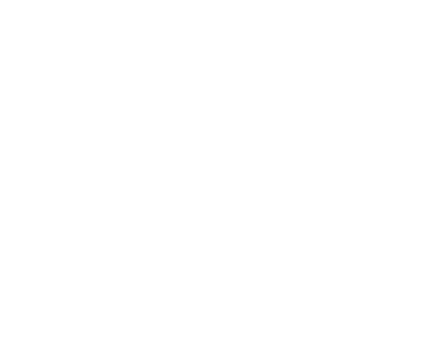

<p align="center">
  
</p>

# Bovine UI

Bovine UI is a small React design system playground built with Vite, TypeScript, React Aria Components, Storybook, and Jest. It is set up as a place to build accessible component primitives, preview them in an app shell, document them in Storybook, and protect changes with lint and build checks before pushing.

## What is included

- Accessible React components built on `react-aria-components`.
- Storybook stories for component development and documentation.
- Jest and Testing Library setup for unit tests.
- A Vite demo app that renders the component gallery.
- A wireframe bull head brand asset available as both SVG and PNG.
- Husky pre-push checks that run lint and build before code is pushed.

## Components

The shared component exports live in `design-system/src/components/index.ts`.

- `BullHeadWireframe` - renders the bull head SVG asset.
- `Button` - React Aria button component.
- `Checkbox` - accessible checkbox control.
- `Label` - reusable form label.
- `Link` - styled link component.
- `Modal` - dialog/modal surface.
- `RadioButton` and `RadioGroupComponent` - grouped radio controls.
- `Switch` - accessible binary toggle.
- `TextArea` - multiline text input.
- `TextField` - single-line text input.
- `Tooltip` - tooltip wrapper for interactive controls.
- `Typography` - shared text variants.

## Getting started

Install dependencies:

```bash
npm install
```

Start the Vite demo app:

```bash
npm run dev
```

Start Storybook:

```bash
npm run storybook
```

## Scripts

- `npm run dev` - starts the local Vite dev server.
- `npm run build` - type-checks the app and creates a production build.
- `npm run lint` - runs ESLint across the project.
- `npm run preview` - previews the production build locally.
- `npm run storybook` - starts Storybook on port `6006`.
- `npm run build-storybook` - creates a static Storybook build.
- `npm test` - runs the Jest test suite.

## Project structure

```text
design-system/
  src/
    assets/
      bull-head-wireframe.svg
      bull-head-wireframe.png
    components/
      <ComponentName>/
        <ComponentName>.tsx
        <ComponentName>.css
        <ComponentName>.stories.tsx
        <ComponentName>.test.tsx
    App.tsx
    App.css
    main.tsx
    theme.css
```

Additional project configuration:

- `.storybook/` - Storybook configuration.
- `.husky/pre-push` - pre-push quality gate.
- `eslint.config.js` - ESLint flat config.
- `jest.config.cjs` - Jest configuration.
- `tsconfig.app.json` - app TypeScript configuration.
- `tsconfig.jest.json` - Jest TypeScript configuration.
- `vite.config.ts` - Vite configuration.

## Quality checks

Before pushing, Husky runs:

```bash
npm run lint
npm run build
```

You can run the same checks manually at any time. Commits can still be made locally, but pushes are blocked until both commands pass.

## Brand asset

The bull head mark lives at:

- `design-system/src/assets/bull-head-wireframe.svg`
- `design-system/src/assets/bull-head-wireframe.png`

The `BullHeadWireframe` component renders the SVG asset directly, which is also used at the top of this README for GitHub preview.
